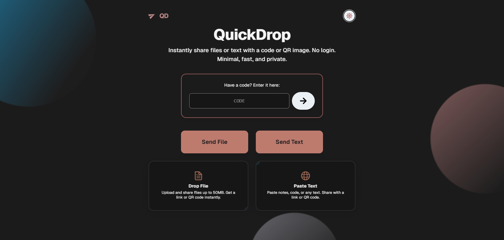

<h1>  QuickDrop</h1>
<p align="center">
  
  <b>Instant, private, and hassle-free file & text sharing.</b><br>
  Share files or notes with a link or QR code. No login. Minimal, fast, and secure.  <a href="https://quickdropx.vercel.app" target="_blank">Visit Now</a> <br>

</p>

---

## 🚀 Features

- **File Sharing:** Upload files up to 50MB and share via a link or QR code
- **Text Sharing:** Share notes, code, or any text with customizable expiration
- **Short Codes:** Generate 4-character codes for easy access
- **No Login Required:** Share instantly, no sign-up or account needed
- **QR Codes:** Instantly generate QR codes for mobile sharing
- **Easy Sharing:** Copy links or share directly to WhatsApp
- **Expiration Options:** Choose 24-hour or 7-day link expiration
- **Modern UI:** Clean, responsive, and mobile-friendly design

---

## 🛠 Getting Started

### Local Development

1. **Clone the repository:**
   ```bash
   git clone https://github.com/yourusername/QuickDrop.git
   cd QuickDrop
   ```

2. **Install dependencies:**
   ```bash
   npm install
   ```

3. **Configure environment variables:**  
   Create a `.env.local` file in the root directory:
   ```
   NEXT_PUBLIC_SUPABASE_URL=your-supabase-url
   NEXT_PUBLIC_SUPABASE_ANON_KEY=your-supabase-anon-key
   ```

4. **Run the development server:**
   ```bash
   npm run dev
   ```
   Open [http://localhost:3000](http://localhost:3000) in your browser.

---

## ☁️ Deploying to Vercel

1. Push your code to a GitHub repository.
2. Connect your GitHub account to [Vercel](https://vercel.com/) and import the repository.
3. Set the following environment variables in your Vercel project settings:
   - `NEXT_PUBLIC_SUPABASE_URL`
   - `NEXT_PUBLIC_SUPABASE_ANON_KEY`
4. Deploy the project.
5. (Optional) Configure your custom domain to `quickdrop.vercel.app` or your own domain.

---

## 🗄 Supabase Setup

1. **Create a `text_drops` table:**
   - `id` (uuid, primary key)
   - `text` (text)
   - `nickname` (text, nullable)
   - `expiry` (timestamp with timezone)
   - `created_at` (timestamp with timezone, default: now())

2. **Create a `codes` table:**
   - `id` (serial, primary key)
   - `code` (varchar(4), unique)
   - `resource_type` (varchar(10)) - 'text' or 'file'
   - `resource_id` (text)
   - `created_at` (timestamp with timezone, default: now())
   - `expiry` (timestamp with timezone)

3. **Create a storage bucket named `drops`** with permissions for anonymous users: INSERT, SELECT.

4. Set up storage policies as needed for uploads/downloads.

See [`supabase-schema-update.sql`](./supabase-schema-update.sql) for schema details.

---

## ⚙️ Environment Variables

- `NEXT_PUBLIC_SUPABASE_URL`: Your Supabase project URL
- `NEXT_PUBLIC_SUPABASE_ANON_KEY`: Your Supabase anonymous key

---

## 🧰 Tech Stack

- [Next.js](https://nextjs.org/)
- [React](https://reactjs.org/)
- [TypeScript](https://www.typescriptlang.org/)
- [Supabase](https://supabase.io/)
- [Tailwind CSS](https://tailwindcss.com/)

---

## 📦 Deploy on Vercel

The easiest way to deploy your Next.js app is to use the [Vercel Platform](https://vercel.com/new?utm_medium=default-template&filter=next.js&utm_source=create-next-app&utm_campaign=create-next-app-readme).

Check out the [Next.js deployment documentation](https://nextjs.org/docs/app/building-your-application/deploying) for more details.

---

<p align="center">
  <b>Made with ❤️ by <a href="https://github.com/LikhithSP" target="_blank">LikhithSP</a></b>
</p>
