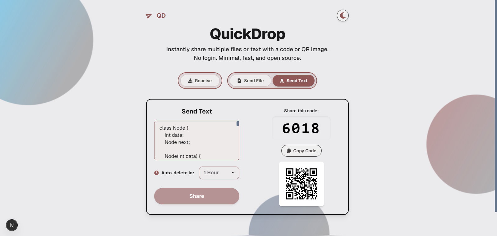

#  QuickDrop

<p align="center">
 
  <br>
  <b>Instant, open source, and hassle-free file & text sharing.</b>
</p>

Share multiple files or notes instantly using 4-digit codes or QR images. No login required. Minimalist, blazing fast, and designed with premium dark/light themes. <a href="https://quickdropx.vercel.app" target="_blank">Visit Now</a> <br>


## ⚡ Key Features

* **Multi-File Sharing:** Select and upload multiple files simultaneously (up to 50MB total). Interactively review the selected files list and remove individual items before sharing.
* **Inline Receiving Flow:** Paste a 4-digit code and fetch files or text drops directly on the Home page. No page reloads, double redirects, or intermediate loading screens.
* **Direct File Downloads:** Programmatic download helper converts files to Blobs to bypass CORS and force direct savings to the computer (rather than opening images/PDFs in new browser tabs).
* **Batch Downloader ("Download All"):** Download all received files in one click. Sequentially fetches and saves each file with automated browser delays.
* **Auto-Copy Clipboard Integration:** Automatically copies retrieved text to the clipboard on load with a temporary theme-matching copied notice.
* **Open Source & Privacy-focused:** Zero accounts, no tracking, and fully custom expiration intervals (from 1 hour up to 7 days).
* **Modern Adaptive Theme:** Beautifully styled dark/light themes featuring glassmorphism, smooth animations, and optimized color variables for both modes.
* **Mobile-First Layout:** A custom horizontal navigation tab bar designed to fit perfectly on small screens without vertical stacking.

---

## 🧰 Tech Stack

* **Frontend Framework:** [Next.js 15](https://nextjs.org/) (App Router)
* **Library:** [React 19](https://reactjs.org/) & [TypeScript](https://www.typescriptlang.org/)
* **Database & Storage:** [Supabase](https://supabase.com/) (PostgreSQL & Storage Buckets)
* **Styling:** [Tailwind CSS v4](https://tailwindcss.com/) & Vanilla CSS variables
* **Icons:** [React Icons](https://react-icons.github.io/react-icons/)
* **QR Generation:** [node-qrcode](https://github.com/soldair/node-qrcode)

---

## 💻 Getting Started

### Prerequisites

* Node.js (v18 or higher)
* npm, yarn, or pnpm
* A Supabase account with Storage and Database tables configured.

### Local Development

1. **Clone the repository:**
   ```bash
   git clone https://github.com/LikhithSP/QuickDrop.git
   cd QuickDrop
   ```

2. **Install dependencies:**
   ```bash
   npm install
   ```

3. **Configure Environment Variables:**
   Create a `.env` file in the root directory and add your Supabase credentials:
   ```env
   NEXT_PUBLIC_SUPABASE_URL=your_supabase_url
   NEXT_PUBLIC_SUPABASE_ANON_KEY=your_supabase_anon_key
   ```

4. **Run the development server:**
   ```bash
   npm run dev
   ```
   Open [http://localhost:3000](http://localhost:3000) in your browser.

---

## 📦 Deployment

This project is configured for deployment on the [Vercel Platform](https://vercel.com/):


